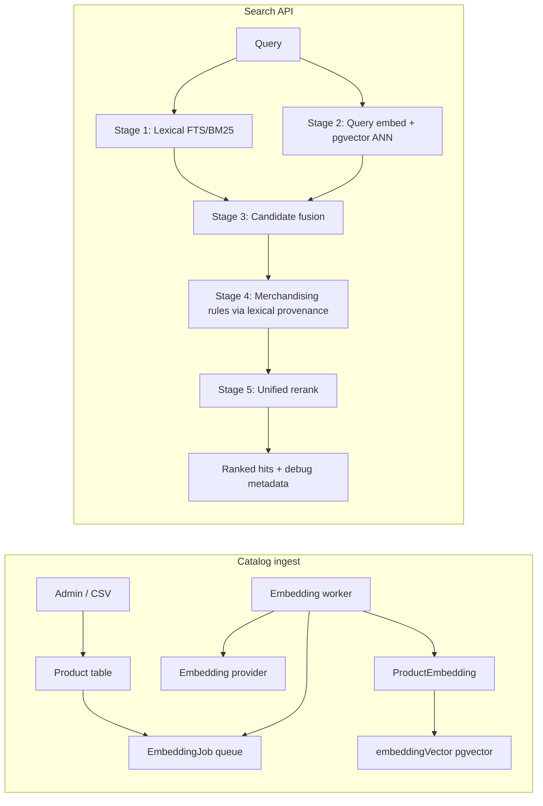

# pgvector Worker + Unified Hybrid Rerank Implementation

Production text-only semantic retrieval for the retailer search platform: PostgreSQL pgvector ANN storage, a Railway-deployable embedding worker, and a unified hybrid fusion + rerank search pipeline.

## Architecture overview



| Component | Location |
|-----------|----------|
| pgvector migrations | `services/search-api/prisma/migrations/` |
| Vector query + sync | `services/search-api/src/catalog/catalog-db-queries.ts` |
| Vector runtime config | `services/search-api/src/ai-search/vector-config.ts` |
| Embedding worker | `services/search-api/src/embedding-worker.ts` |
| Job queue (SKIP LOCKED) | `services/search-api/src/ai-search/embedding-job-queue.ts` |
| Fusion | `services/search-api/src/ai-search/candidate-fusion.ts` |
| Unified rerank | `services/search-api/src/ai-search/unified-rerank.ts` |
| Pipeline orchestration | `services/search-api/src/ai-search/hybrid-ranking-pipeline.ts` |

## Schema changes

### ProductEmbedding

| Column | Purpose |
|--------|---------|
| `embedding` | JSON array (legacy + in-memory fallback) |
| `embeddingVector` | `vector(64)` pgvector column for ANN |
| `textHash` | Content hash (`content_hash`) for dedupe |
| `sourceText` | Canonical text embedded |
| `model`, `provider`, `dimensions` | Embedding metadata |
| `createdAt`, `updatedAt`, `lastIndexedAt` | Lifecycle timestamps |

One active row per `productId` (PK). Re-embed updates in place when `textHash` changes.

### EmbeddingJob

PostgreSQL-backed queue with claim/retry/dead-letter:

| Column | Purpose |
|--------|---------|
| `status` | `queued`, `running`, `completed`, `failed`, `dead_letter` |
| `jobType` | `backfill`, `incremental`, `reindex` |
| `productIds` | Optional JSON array for scoped jobs |
| `retryCount`, `maxRetries`, `nextRunAt` | Exponential backoff retries |
| `lockedAt`, `lockedBy` | Multi-worker concurrency (`SKIP LOCKED`) |
| `processedProducts`, `failedProducts`, `skippedProducts` | Observability |

Migration: `20260619120000_pgvector_worker_rerank`.

## Index strategy: HNSW vs IVFFlat

**Default: HNSW** (`VECTOR_INDEX_TYPE=hnsw`)

| | HNSW | IVFFlat |
|---|------|---------|
| Build | No training step; works on small catalogs | Needs enough rows before build |
| Recall | Strong out of the box | Tunable via `ivfflat.probes` |
| Ops | Rebuild during low traffic if needed | Rebuild after major backfill |
| Railway | Recommended default | Use at 100k+ vectors if probe tuning preferred |

**Why HNSW was chosen as default:** Railway Postgres + pgvector supports HNSW; it avoids IVFFlat’s “train after bulk load” operational step and delivers good recall/latency for current catalog sizes (~12k–80k demo scale).

### Rebuild indexes

```bash
cd services/search-api
DATABASE_URL="..." VECTOR_INDEX_TYPE=hnsw node scripts/rebuild-vector-index.mjs

# IVFFlat (after backfill, lists ~ sqrt(N) to N/1000)
DATABASE_URL="..." VECTOR_INDEX_TYPE=ivfflat VECTOR_INDEX_LISTS=200 node scripts/rebuild-vector-index.mjs
```

### Tune recall vs latency

| Index | Env var | SQL session | Effect |
|-------|---------|-------------|--------|
| HNSW | `VECTOR_QUERY_EF_SEARCH` (default 40) | `SET hnsw.ef_search = N` | Higher = better recall, slower |
| IVFFlat | `VECTOR_QUERY_PROBES` (default 10) | `SET ivfflat.probes = N` | Higher = better recall, slower |

Applied automatically in `searchEmbeddingsFromDatabase()`.

## Railway deployment model

### Search API (existing service)

`railway.toml` → `pnpm --filter @retailer-search/search-api start:prod`

### Embedding worker (new service)

1. Duplicate Railway service from same repo.
2. Set config path: `services/search-api/railway.worker.toml` or override start command:
   ```
   pnpm --filter @retailer-search/search-api start:worker
   ```
3. Share `DATABASE_URL` via Railway reference variable (private networking).
4. Set worker env:

```env
EMBEDDING_WORKER_ENABLED=true
EMBEDDINGS_PROVIDER=openai
EMBEDDINGS_API_KEY=...
EMBEDDINGS_MODEL=text-embedding-3-small
EMBEDDING_DIMENSIONS=64
EMBEDDINGS_BATCH_SIZE=32
EMBEDDINGS_CONCURRENCY=1
EMBEDDING_WORKER_POLL_MS=2000
```

### Cron backfill sweep (optional)

```env
EMBEDDING_BACKFILL_CRON_ENABLED=true
```

Worker enqueues a `backfill` job when embedded count < product count and no jobs are pending.

## Worker model

1. Admin triggers job → `POST /api/v1/admin/ai-search/embedding-jobs`
2. If `EMBEDDING_WORKER_ENABLED=true`, job stays `queued`; worker claims it.
3. If worker disabled, API runs job inline (legacy dev/small deploy).
4. Product admin update → incremental job for changed `productId`.
5. Worker batches products, builds canonical text, calls provider, upserts JSON + `embeddingVector`.
6. Content-hash skip: unchanged `textHash` + same model → skip provider call.
7. Failures retry with exponential backoff; exceed `maxRetries` → `dead_letter`.

## Hybrid retrieval flow

1. **Lexical** — existing `searchProducts()` (FTS/BM25, rules, facets).
2. **Vector** — query embedding → pgvector cosine ANN (`<=>`) on `embeddingVector`.
3. **Fusion** — union lexical + semantic IDs; preserve `retrievalSources`, normalized scores.
4. **Rules** — merchandising adjustments from lexical hit provenance (`appliedRuleNames`).
5. **Rerank** — single `unifiedRerankCandidates()` over fused set.

Feature flags:

| Flag | Effect |
|------|--------|
| `HYBRID_SEARCH_ENABLED` | Master hybrid toggle |
| `SEMANTIC_SEARCH_ENABLED` / `VECTOR_SEARCH_ENABLED` | Vector retrieval stage |
| `PGVECTOR_ENABLED=false` | Skip pgvector queries |
| `RERANK_ENABLED` | Enable unified rerank stage |
| `RERANK_PROVIDER=score_fusion` | Weighted fusion (default) |

Preview modes (admin): `lexical`, `semantic`, `hybrid`, `hybrid_rerank`, `hybrid_personalization`, `semantic_rescue`.

## Rerank flow

- **Score fusion** (default): `lexicalWeight * lexical + semanticWeight * semantic + personalizationWeight * personalization`
- **Optional provider** (`cross_encoder`, `llm`): bounded top-N (`RERANK_TOP_N`), timeout (`RERANK_TIMEOUT_MS`), fail-open to fusion on error.
- Debug fields on hits: `lexicalScore`, `semanticScore`, `fusedScore`, `rerankScore`, `retrievalSources`, `explanationCodes`.

## Environment variables

See `.env.example` for full list. Key groups:

**Database / vector:** `PGVECTOR_ENABLED`, `VECTOR_DISTANCE_METRIC`, `VECTOR_INDEX_TYPE`, `VECTOR_INDEX_LISTS`, `VECTOR_QUERY_PROBES`, `VECTOR_QUERY_EF_SEARCH`

**Embeddings:** `EMBEDDINGS_PROVIDER`, `EMBEDDINGS_MODEL`, `EMBEDDINGS_API_KEY`, `EMBEDDING_DIMENSIONS`, `EMBEDDINGS_BATCH_SIZE`, `EMBEDDINGS_MAX_RETRIES`, `EMBEDDINGS_CONCURRENCY`

**Worker:** `EMBEDDING_WORKER_ENABLED`, `EMBEDDING_WORKER_POLL_MS`, `EMBEDDING_BACKFILL_CRON_ENABLED`

**Search pipeline:** `HYBRID_SEARCH_ENABLED`, `VECTOR_SEARCH_ENABLED`, `RERANK_ENABLED`, `RERANK_PROVIDER`, `RERANK_TOP_N`, `RERANK_TIMEOUT_MS`

## Recommended defaults

| Setting | Recommendation |
|---------|----------------|
| Index | HNSW on Railway until catalog exceeds ~500k vectors |
| Worker concurrency | `1` per worker replica; scale horizontally |
| Batch size | `32` (raise to 64 if provider rate limits allow) |
| Backfill | Queue one `backfill` job after deploy; avoid inline on API |
| Rerank top-N | `50` fused candidates |
| HNSW ef_search | `40` (raise to 100 for hard queries in admin debug) |

## Failure modes

| Failure | Behavior |
|---------|----------|
| pgvector unavailable | Vector stage returns empty; lexical continues |
| Embedding provider error | Job retries → dead letter; search unaffected |
| Rerank provider timeout | Fail-open to score fusion |
| Stale worker lock | Reclaimed after `EMBEDDING_JOB_LOCK_TIMEOUT_MS` |
| Dimension mismatch | Must match `vector(64)` migration and `EMBEDDING_DIMENSIONS` |

## Operational runbook

1. **Enable semantic search:** set `HYBRID_SEARCH_ENABLED=true`, `SEMANTIC_SEARCH_ENABLED=true`, configure provider + API key.
2. **Deploy worker service** with `EMBEDDING_WORKER_ENABLED=true`.
3. **Trigger backfill** from Admin → AI Search → Reindex (or POST embedding-jobs).
4. **Verify coverage:** `GET /api/v1/admin/ai-search/embedding-coverage`.
5. **Validate search:** Admin query preview modes (lexical / semantic / hybrid / hybrid_rerank).
6. **After large backfill:** run `scripts/rebuild-vector-index.mjs` if switching to IVFFlat or recall drops.
7. **Monitor jobs:** `GET /api/v1/admin/ai-search/embedding-jobs`; investigate `dead_letter` rows.
8. **Tune latency:** lower `VECTOR_QUERY_EF_SEARCH` or `CATALOG_VECTOR_SEARCH_LIMIT`; raise for admin debug sessions.

## Tests

```bash
pnpm --filter @retailer-search/search-api test
```

Covers fusion dedupe, unified rerank scoring, vector config defaults, content-hash stability.
